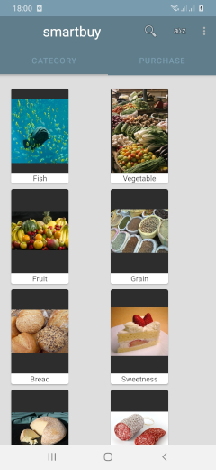

# smartbuy

Android application for simple buying products in shops.

The purpose of the application is to simplify buying products in shops using  
user friendly interface.

Used Android libraries:
-----------------------
  * AppCompat
  * Android KTX
  * Data Binding
  * Lifecycles/LiveData
  * Navigation
  * Room
  * ViewModel
  * WorkManager
  
Used third party libraries:
--------------------------
  * Glide
  * Kotlin Coroutines
  