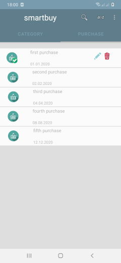

# smartbuy

Android application for simple buying products in shops.

The purpose of the application is to simplify buying products in shops using  
user friendly interface.

Architecture:
------------
MVVM (Model View ViewModel)

Branches:
------------
  * master   - using compose base graphic user interface
  * viewbase - using view base graphic user interface

Used Android libraries:
-----------------------
  * AppCompat
  * Android KTX
  * App Startup
  * Compose
  * Lifecycle/LiveData
  * Pagging
  * Navigation
  * Room
  * Data Store
  * ViewModel
  * WorkManager
  
Used third party libraries:
--------------------------
  * Timber
  * Coil
  * Hilt 
  * Kotlin Coroutines
  
